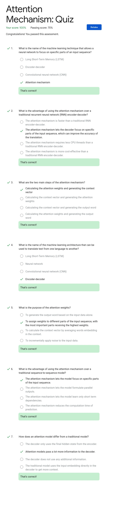

# Advanced: Generative AI for Developers Learning Path

- [Advanced: Generative AI for Developers Learning Path](#advanced-generative-ai-for-developers-learning-path)
  - [1️⃣ Introduction to Image Generation](#1️⃣-introduction-to-image-generation)
  - [2️⃣ Attention Mechanism](#2️⃣-attention-mechanism)
  - [3️⃣ Encoder-Decoder Architecture](#3️⃣-encoder-decoder-architecture)
  - [4️⃣ Transformer Models and BERT Model](#4️⃣-transformer-models-and-bert-model)
  - [5️⃣ Create Image Captioning Models](#5️⃣-create-image-captioning-models)
  - [6️⃣ Introduction to Vertex AI Studio](#6️⃣-introduction-to-vertex-ai-studio)
  - [7️⃣ Vector Search and Embeddings](#7️⃣-vector-search-and-embeddings)
  - [8️⃣ Inspect Rich Documents with Gemini Multimodality and Multimodal RAG](#8️⃣-inspect-rich-documents-with-gemini-multimodality-and-multimodal-rag)
    - [Challenge Lab](#challenge-lab)
  - [9️⃣ Responsible AI for Developers: Fairness \& Bias](#9️⃣-responsible-ai-for-developers-fairness--bias)
  - [🇦 Responsible AI for Developers: Interpretability \& Transparency](#-responsible-ai-for-developers-interpretability--transparency)
  - [🇧 Responsible AI for Developers: Privacy \& Safety](#-responsible-ai-for-developers-privacy--safety)
  - [🇨 Machine Learning Operations (MLOps) for Generative AI](#-machine-learning-operations-mlops-for-generative-ai)

## 1️⃣ Introduction to Image Generation

<details>
  <summary>Quiz</summary>


</details>

## 2️⃣ Attention Mechanism

<details>
  <summary>Quiz</summary>



</details>

## 3️⃣ Encoder-Decoder Architecture

<details>
  <summary>Quiz</summary>


</details>

## 4️⃣ Transformer Models and BERT Model

<details>
  <summary>Quiz</summary>


</details>

## 5️⃣ Create Image Captioning Models

<details>
  <summary>Quiz</summary>


</details>

## 6️⃣ Introduction to Vertex AI Studio

<details>
  <summary>Quiz</summary>


</details>

## 7️⃣ Vector Search and Embeddings

<details>
  <summary>Quiz</summary>


</details>

## 8️⃣ Inspect Rich Documents with Gemini Multimodality and Multimodal RAG

### Challenge Lab

REF: <https://github.com/Techcps/GSP-Short-Trick/blob/main/Inspect%20Rich%20Documents%20with%20Gemini%20Multimodality%20and%20Multimodal%20RAG%20Challenge%20Lab/inspect_rich_documents_w_gemini_multimodality_and_multimodal_rag.ipynb>

<details>
  <summary>Task 1.1</summary>

```python
# "COMPLETE THE MISSING PART AND RUN THIS CELL"

# Now, you're going to create an input for your multimodal model. Create your contents list using the variables above. Ensure the structure matches the format expected by the multimodal model.

contents = [
    instructions,
    image_ask_first_1,
    prompt1,
    image_dont_do_this_1,
    prompt2,
]
```

```python
# "COMPLETE THE MISSING PART AND RUN THIS CELL"

# In the next part of this task, you're going to generate responses from the multimodal model. Capture the output of the model in the "responses" variable by using your "contents" list.

responses = multimodal_model.generate_content(contents, stream=True)
```

```python
# "COMPLETE THE MISSING PART AND RUN THIS CELL"

# In the last part of this task, you're going to print your contents and responses with the prompt and responses title provided. Use descriptive titles to help organize the output (e.g., "Prompts", "Model Responses") and then display the prompt and responses by using the print() function.

# Hint: "\n" inserts a newline character for clearer separation between the sections.


print("-------Prompt-------")
print_multimodal_prompt(contents)

print("\n-------Response-------")
for response in responses:
    print(response.text, end="")
```

</details>

<details>
  <summary>Task 1.2</summary>

```python
# "COMPLETE THE MISSING PART AND RUN THIS CELL"

# Now, you're going to create an input for your multimodal model. Create your contents list using the variables above. Ensure the structure matches the format expected by the multimodal model.

contents = [prompt1, image_ask_first_3, prompt2, image_dont_do_this_3, prompt3]
```

```python
# "COMPLETE THE MISSING PART AND RUN THIS CELL"

# Now, you're going to set configuration parameters that will influence how the multimodal model generates text. These settings control aspects like the creativity and focus of the responses. Here's how:
# Temperature: Controls randomness. Lower values mean more predictable results, higher values mean more surprising and creative outpu
# Top p / Top k: Affects how the model chooses words. Explore different values to see how they change the results.
# Other parameters: Check the model's documentation for additional options you might want to adjust.

# Store your configuration parameters in a generation_config variable. This improves reusability, allowing you to easily apply the same settings across tasks and make adjustments as needed.

generation_config = GenerationConfig(
    temperature=0.0,
    top_p=0.8,
    top_k=40,
    candidate_count=1,
    max_output_tokens=2048,
)
```

```python
# "COMPLETE THE MISSING PART AND RUN THIS CELL"

# In the next part of this task, you're going to generate responses from a multimodal model. capture the output of the model in the "responses" variable by using your "contents" list and the confiuguration settings.


responses = multimodal_model.generate_content(
    contents,
    generation_config=generation_config,
    stream=True,
)
```

```python
# "COMPLETE THE MISSING PART AND RUN THIS CELL"

# In the last part of this task, you're going to print your contents and responses with the prompt and responses title provided. Use descriptive titles to help organize the output (e.g., "Prompts", "Model Responses") and then display the prompt and responses by using the print() function.

# Hint: "\n" inserts a newline character for clearer separation between the sections.

print("-------Prompt-------")
print_multimodal_prompt(contents)

print("\n-------Response-------")
for response in responses:
    print(response.text, end="")
```

</details>

<details>
  <summary>Task 1.3</summary>

```python
# "COMPLETE THE MISSING PART AND RUN THIS CELL"

# Now, you're going to create an input for your multimodal model. Create your contents list using the variables above. Ensure the structure matches the format expected by the multimodal model.

contents = [prompt, video]
```

```python
# "COMPLETE THE MISSING PART AND RUN THIS CELL"

# In the next part of this task, you're going to generate responses from a multimodal model. Capture the output of the model in the "responses" variable by using your "contents" list.


responses = multimodal_model.generate_content(contents, stream=True)
```

```python
# "COMPLETE THE MISSING PART AND RUN THIS CELL"

# In the last part of this task, you're going to print your contents and responses with the prompt and responses title provided. Use descriptive titles to help organize the output (e.g., "Prompts", "Model Responses") and then display the prompt and responses by using the print() function.

# Hint: "\n" inserts a newline character for clearer separation between the sections.

print("-------Prompt-------")
print_multimodal_prompt(contents)

print("\n-------Response-------")
for response in responses:
    print(response.text, end="")
```

</details>

<details>
  <summary>Task 1.4</summary>

```python
# "COMPLETE THE MISSING PART AND RUN THIS CELL"

# You're going to work with provided variables in this task. First, review and describe the content/purpose of each variable below.

prompt = """
Answer the following questions using the video only:

Which particular sport is highlighted in the video?
What values or beliefs does the advertisement communicate about the brand?
What emotions or feelings does the advertisement evoke in the audience?
Which tags associated with objects featured throughout the video could be extracted?
"""
video = Part.from_uri(
    uri="gs://spls/gsp520/google-pixel-8-pro.mp4",
    mime_type="video/mp4",
)
```

```python
# "COMPLETE THE MISSING PART AND RUN THIS CELL"

# Now, you're going to create an input for your multimodal model. Create your contents list using the variables above. Ensure the structure matches the format expected by the multimodal model.

contents = [prompt, video]
```

```python
# "COMPLETE THE MISSING PART AND RUN THIS CELL"

# In the next part of this task, you're going to generate responses from a multimodal model. Capture the output of the model in the "responses" variable by using your "contents" list.


responses = multimodal_model.generate_content(contents, stream=True)
```

```python
# "COMPLETE THE MISSING PART AND RUN THIS CELL"

# In the last part of this task, you're going to print your contents and responses with the prompt and responses title provided. Use descriptive titles to help organize the output (e.g., "Prompts", "Model Responses") and then display the prompt and responses by using the print() function.

# Hint: "\n" inserts a newline character for clearer separation between the sections.

print("-------Prompt-------")
print_multimodal_prompt(contents)

print("\n-------Response-------")
for response in responses:
    print(response.text, end="")
```

</details>

<details>
  <summary>Task 1.5</summary>

```python
# "COMPLETE THE MISSING PART AND RUN THIS CELL"

# You're going to work with provided variables in this task.
# First, review and describe the content/purpose of each variable below.


prompt = """
Answer the following questions using the video only:

How does the advertisement portray the use of technology, specifically AI, in capturing and preserving memories?
What visual cues or storytelling elements contribute to the nostalgic atmosphere of the advertisement?
How does the advertisement depict the role of friendship and social connections in enhancing experiences and creating memories?
Are there any specific features or functionalities of the phone highlighted in the advertisement, besides its AI capabilities?

Provide the answer JSON.
"""
video = Part.from_uri(
    uri="gs://spls/gsp520/google-pixel-8-pro.mp4",
    mime_type="video/mp4",
)
```

```python
# "COMPLETE THE MISSING PART AND RUN THIS CELL"

# Now, you're going to create an input for your multimodal model. Create your contents list using the variables above. Ensure the structure matches the format expected by the multimodal model.

contents = [prompt, video]
```

```python
# "COMPLETE THE MISSING PART AND RUN THIS CELL"

# In the next part of this task, you're going to generate responses from a multimodal model. Capture the output of the model in the "responses" variable by using your "contents" list.


responses = multimodal_model.generate_content(contents, stream=True)
```

```python
# "COMPLETE THE MISSING PART AND RUN THIS CELL"

# In the last part of this task, you're going to print your contents and responses with the prompt and responses title provided. Use descriptive titles to help organize the output (e.g., "Prompts", "Model Responses") and then display the prompt and responses by using the print() function.

# Hint: "\n" inserts a newline character for clearer separation between the sections.

print("-------Prompt-------")
print_multimodal_prompt(contents)

print("\n-------Response-------")
for response in responses:
    print(response.text, end="")
```

</details>

<details>
  <summary>Task 1.6</summary>

```python
# "COMPLETE THE MISSING PART AND RUN THIS CELL"

# You're going to work with provided variables in this task.
# First, review and describe the content/purpose of each variable below.


prompt = """
Answer the following questions using the video only:

How does the advertisement appeal to its target audience through its messaging and imagery?
What overall message or takeaway does the advertisement convey about the brand and its products?
Are there any symbolic elements or motifs used throughout the advertisement to reinforce its central themes?
What is the best hashtag for this video based on the description ?

"""
video = Part.from_uri(
    uri="gs://spls/gsp520/google-pixel-8-pro.mp4",
    mime_type="video/mp4",
)
```

```python
# "COMPLETE THE MISSING PART AND RUN THIS CELL"

# Now, you're going to create an input for your multimodal model. Create your contents list using the variables above. Ensure the structure matches the format expected by the multimodal model.

contents = [prompt, video]
```

```python
# "COMPLETE THE MISSING PART AND RUN THIS CELL"

# In the next part of this task, you're going to generate responses from a multimodal model. Capture the output of the model in the "responses" variable by using your "contents" list.


responses = multimodal_model.generate_content(contents, stream=True)
```

```python
# "COMPLETE THE MISSING PART AND RUN THIS CELL"

# In the last part of this task, you're going to print your contents and responses with the prompt and responses title provided. Use descriptive titles to help organize the output (e.g., "Prompts", "Model Responses") and then display the prompt and responses by using the print() function.

# Hint: "\n" inserts a newline character for clearer separation between the sections.

print("-------Prompt-------")
print_multimodal_prompt(contents)

print("\n-------Response-------")
for response in responses:
    print(response.text, end="")
```

</details>

<details>
  <summary>Task 2.1</summary>

```python
# "COMPLETE THE MISSING PART AND RUN THIS CELL"

# Call the "get_document_metadata" function from the utils file to extract text and image metadata from the PDF document. Store the results in two different DataFrames: "text_metadata_df" and "image_metadata_df".
# text_metadata_df: This will contain extracted text snippets, their corresponding page numbers, and potentially other relevant information.
# image_metadata_df: This will contain descriptions of the images found in the PDF (if any), along with their location within the document.

text_metadata_df, image_metadata_df = get_document_metadata(
    multimodal_model, # we are passing gemini 1.0 pro vision model
    pdf_folder_path,
    image_save_dir="images",
    image_description_prompt=image_description_prompt,
    embedding_size=1408,
)

print("\n\n --- Completed processing. ---")
```

```python
# "COMPLETE THE MISSING PART AND RUN THIS CELL"

# Explore the text_metadata_df dataframe by displaying the first few rows of the dataframe.

text_metadata_df.head()
```

```python
# "COMPLETE THE MISSING PART AND RUN THIS CELL"

# Import helper functions from utils.

from utils.intro_multimodal_rag_utils import (
    get_similar_text_from_query,
    print_text_to_text_citation,
    get_similar_image_from_query,
    print_text_to_image_citation,
    get_gemini_response,
    display_images,
)
```

</details>

<details>
  <summary>Task 2.3</summary>

```python
# "COMPLETE THE MISSING PART AND RUN THIS CELL"

# Call the "get_similar_text_from_query" function from the utils file to retrieve relevant chunks of text based on the query. Store the results in a dictionart called "matching_results_chunks_data".
# matching_results_chunks_data: This dictionary will contain file_name, page_num, cosine_score, chunk_number and chunk_socre. The dictionary represents a search result for a query related to the text_metadata_df.

matching_results_chunks_data = get_similar_text_from_query(
    query,
    text_metadata_df,
    column_name="text_embedding_chunk",
    top_n=10,
    chunk_text=True,
)
```

```python
# "COMPLETE THE MISSING PART AND RUN THIS CELL"

# Explore the first item in your matching_results_chunks_data dictionary by displaying the first item.

print_text_to_text_citation(
    matching_results_chunks_data,
    print_top=False,
    chunk_text=True,
)
```

</details>

<details>
  <summary>Task 2.4</summary>

```python
# "COMPLETE THE MISSING PART AND RUN THIS CELL"


# Create an empty list named "context_text". This list will be used to store the combined chunks of text.
context_text = list()
```

```python
# "COMPLETE THE MISSING PART AND RUN THIS CELL"

# Create a for loop to iterate through each item in the matching_results_chunks_data dictionary in order to combine all the selected relevant text chunks


for key, value in matching_results_chunks_data.items():
    context_text.append(value["chunk_text"])
```

```python
# "COMPLETE THE MISSING PART AND RUN THIS CELL"

# Take all of the individual text chunks stored in the context_text list and join them together into a single string named final_context_text. Use "\n" part inserts a newline character between each chunk, effectively creating separate lines or paragraphs.

final_context_text = "\n".join(context_text)
```

</details>

<details>
  <summary>Task 2.5</summary>

```python
# "COMPLETE THE MISSING PART AND RUN THIS CELL"

# Call "get_gemini_response" function from utils module in order to generate Gemini response with streaming output. This function uses a multimodal Gemini model, a text prompt, and configuration parameters and instructs the Gemini model to generate a response using the provided prompt. As Gemini model enables streaming, you will receive chunks of the response as they were produced.
# Format the streamed output using Markdown syntax for easy readability and conversion to HTML.

Markdown(
    get_gemini_response(
        multimodal_model,
        model_input=[prompt],
        stream=True,
        generation_config=GenerationConfig(temperature=0.2, max_output_tokens=2048),
    )
)
```

</details>

## 9️⃣ Responsible AI for Developers: Fairness & Bias

<details>
  <summary>Quiz 1</summary>


</details>

<details>
  <summary>Quiz 2</summary>


</details>

## 🇦 Responsible AI for Developers: Interpretability & Transparency

<details>
  <summary>Quiz</summary>


</details>

## 🇧 Responsible AI for Developers: Privacy & Safety

<details>
  <summary>Quiz 1</summary>


</details>

<details>
  <summary>Quiz 2</summary>


</details>

## 🇨 Machine Learning Operations (MLOps) for Generative AI
<!-- TODO -->
