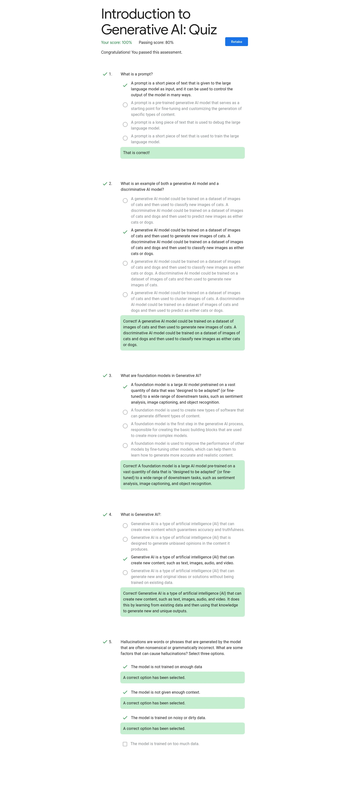
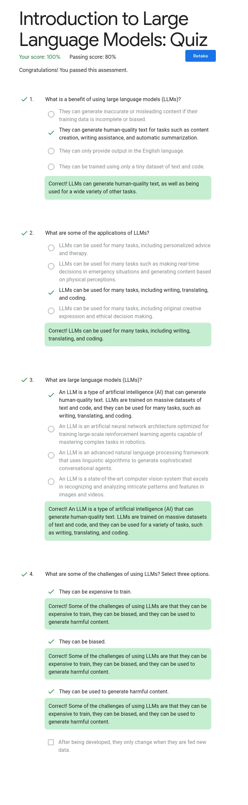
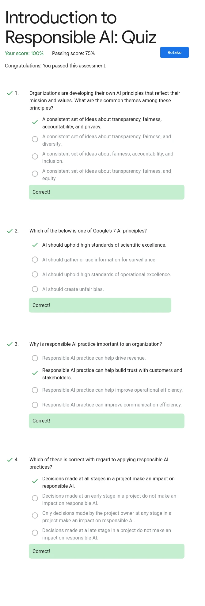
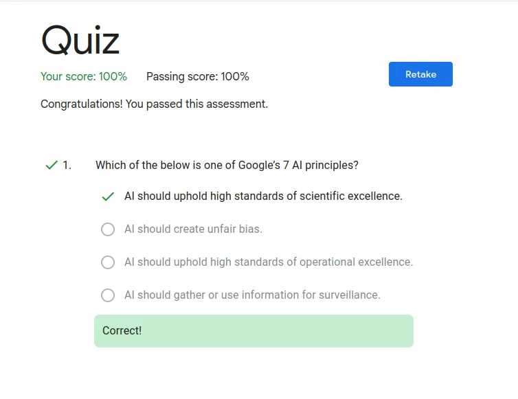

# Beginner: Introduction to Generative AI Learning Path

- [Beginner: Introduction to Generative AI Learning Path](#beginner-introduction-to-generative-ai-learning-path)
  - [1️⃣ Introduction to Generative AI](#1️⃣-introduction-to-generative-ai)
  - [2️⃣ Introduction to Large Language Models](#2️⃣-introduction-to-large-language-models)
  - [3️⃣ Introduction to Responsible AI](#3️⃣-introduction-to-responsible-ai)
  - [4️⃣ Prompt Design in Vertex AI](#4️⃣-prompt-design-in-vertex-ai)
    - [Lab1](#lab1)
    - [Lab2](#lab2)
    - [Lab3](#lab3)
    - [Challenge Lab](#challenge-lab)
  - [5️⃣ Responsible AI: Applying AI Principles with Google Cloud](#5️⃣-responsible-ai-applying-ai-principles-with-google-cloud)

## 1️⃣ Introduction to Generative AI

<https://www.cloudskillsboost.google/paths/118/course_templates/536>

<details>
  <summary>直接做 Quiz</summary>



</details>

## 2️⃣ Introduction to Large Language Models

<https://www.cloudskillsboost.google/paths/118/course_templates/539>

<details>
  <summary>直接做 Quiz</summary>



</details>

## 3️⃣ Introduction to Responsible AI

<https://www.cloudskillsboost.google/paths/118/course_templates/554>

<details>
  <summary>直接做 Quiz</summary>



</details>

## 4️⃣ Prompt Design in Vertex AI

<https://www.cloudskillsboost.google/paths/118/course_templates/976>

### Lab1

按照步驟打開後先將程式碼裡的 `[PROJECT-ID]` 和 `[REGION]` 換掉，然後一步一步點，點到過

> [!IMPORTANT]
> 請記得一步一步點，他感覺有 Rate Limit，全部執行會發現 Kernel 一下子就壞掉重啟

### Lab2

沒難度，照作即可

### Lab3

一路點下去即可

### Challenge Lab

> [!IMPORTANT]
> 記得調整成 `gemini-1.5-pro-*` model

<details>
  <summary><strong>Build a Gemini image analysis tool.</strong></summary>

參考 prompt:

```txt
Generate the following:
Short, descriptive text inspired by the image.
Catchy phrases suitable for advertisements.
A poetic description for a nature-focused campaign.
```

~~對，就是抄題目的~~

> [!NOTE]
> Save Prompt 超級慢！！平均可能要三到五分鐘！！要有耐心

</details>

<details>
  <summary><strong>Build a Gemini tagline generator.</strong></summary>

本 Lab 最大難關

要求兩個 example 可以先不管，先寫一個就好。

Prompt 參考：

```txt
Product attributes: durable
Target audience: young adventurers
Emotional resonance: empowered
```

Test input 參考：

```txt
Write a tagline for a series of shoes designed for hikers.
```

此時會生出一大堆東西，找一個不錯到標語，並將 test input 作為新的一組 example，再 execute 一次。
結束後將 prompt 換掉，再執行一次，重複換掉並執行幾次後，應該就可以了！如果不行的話，右邊的 token limit 可以調小一點試試看。

</details>

<details>
  <summary><strong>Experiment with image analysis code.</strong></summary>

按照說明將 python code 貼上，要注意的是前兩行：

```txt
pip install ...
gcloud ...
```

前面要加 `%`

Prompt 參考：

```python
"""Describe this image with a focus on colors, textures, and the feeling it evokes.
The output MUST less than 10 words."""
```

</details>

<details>
  <summary><strong>Experiment with tagline generation code.</strong></summary>

照作但在最後一個 input 的 prompt 補上：

```txt
that the tagline includes the keyword: nature
```

應該就會過了

</details>

## 5️⃣ Responsible AI: Applying AI Principles with Google Cloud

<https://www.cloudskillsboost.google/paths/118/course_templates/388>

<details>
  <summary>直接做 Quiz</summary>



</details>
