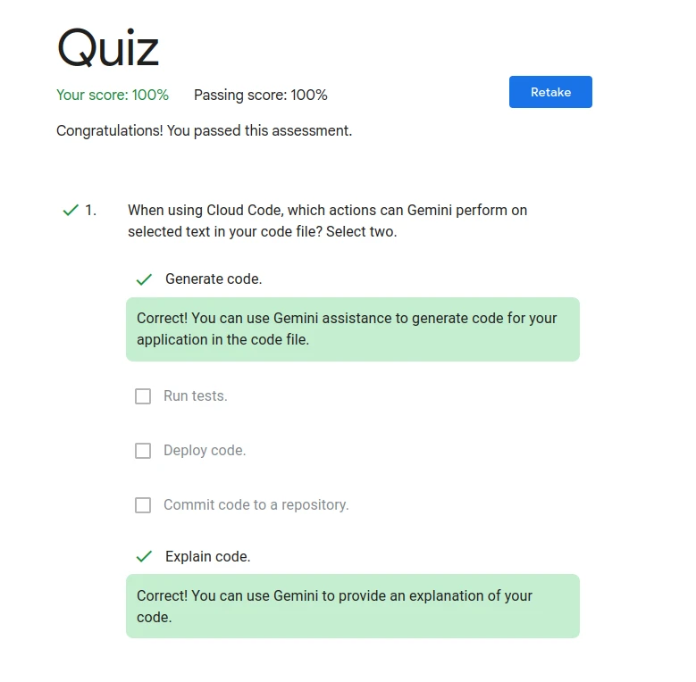
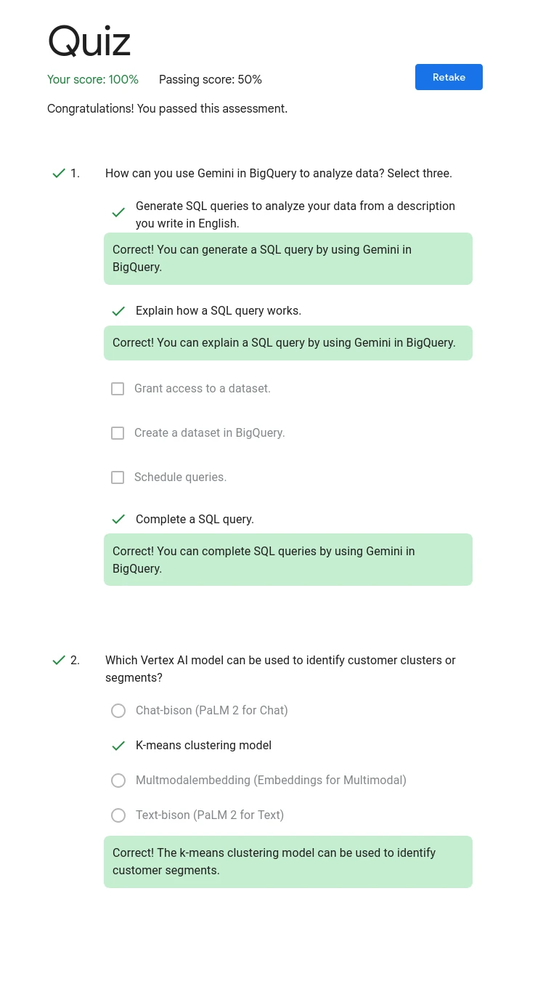
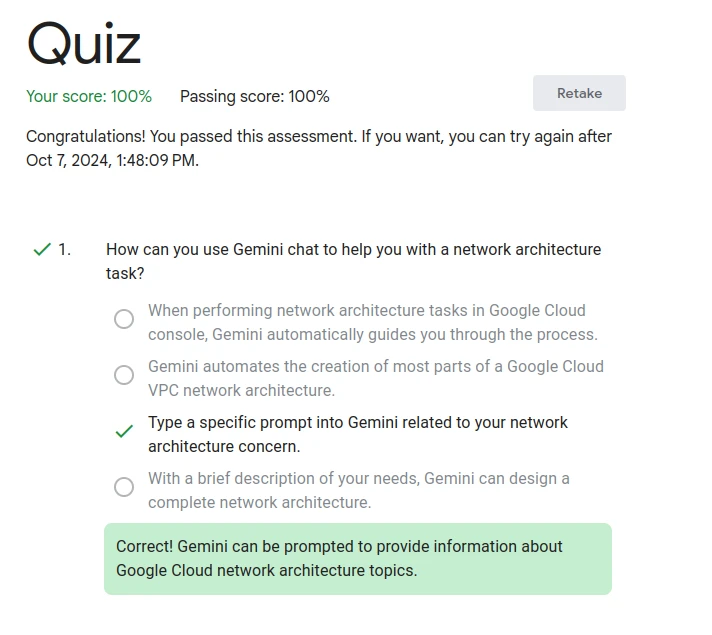
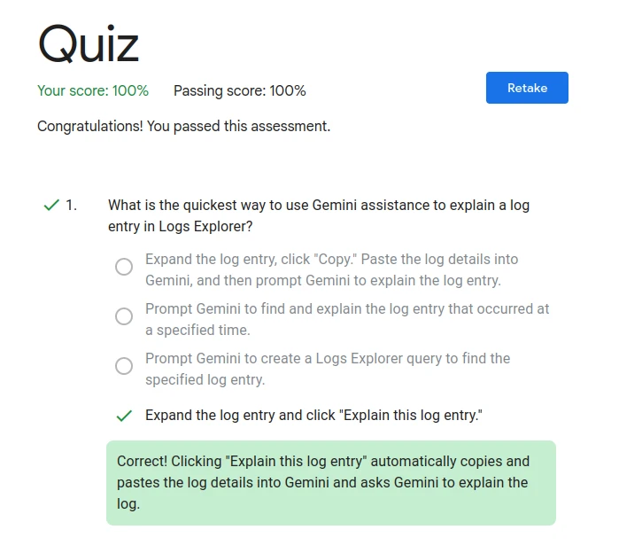
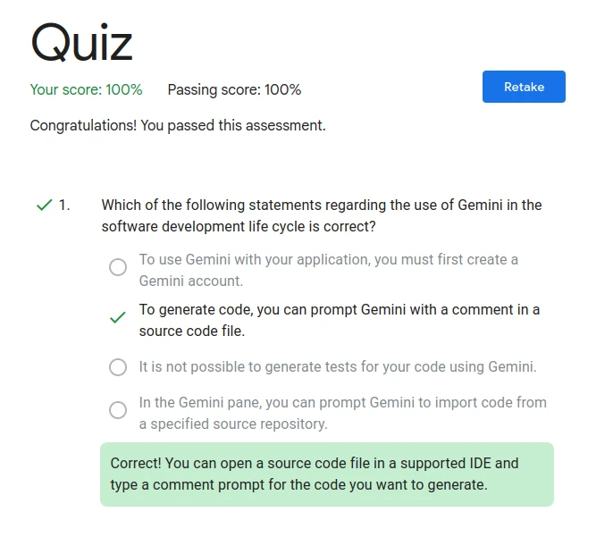

# Intermediate: Gemini for Google Cloud Learning Path

- [Intermediate: Gemini for Google Cloud Learning Path](#intermediate-gemini-for-google-cloud-learning-path)
  - [1️⃣ Gemini for Application Developers](#1️⃣-gemini-for-application-developers)
    - [Develop an app with Gemini](#develop-an-app-with-gemini)
    - [Quiz](#quiz)
  - [2️⃣ Gemini for Cloud Architects](#2️⃣-gemini-for-cloud-architects)
  - [3️⃣ Gemini for Data Scientists and Analysts](#3️⃣-gemini-for-data-scientists-and-analysts)
  - [4️⃣ Gemini for Network Engineers](#4️⃣-gemini-for-network-engineers)
  - [5️⃣ Gemini for Security Engineers](#5️⃣-gemini-for-security-engineers)
  - [6️⃣ Gemini for DevOps Engineers](#6️⃣-gemini-for-devops-engineers)
  - [7️⃣ Gemini for end-to-end SDLC](#7️⃣-gemini-for-end-to-end-sdlc)
  - [8️⃣ Develop GenAI Apps with Gemini and Streamlit](#8️⃣-develop-genai-apps-with-gemini-and-streamlit)

## 1️⃣ Gemini for Application Developers

### Develop an app with Gemini
<!-- markdownlint-disable MD036 -->

**Task 1. Configure your environment and account**

打開 Cloud Shell 貼一貼就好 沒難度

```sh
PROJECT_ID=$(gcloud config get-value project)
REGION=us-central1
echo "PROJECT_ID=${PROJECT_ID}"
echo "REGION=${REGION}"
USER=$(gcloud config get-value account 2> /dev/null)
echo "USER=${USER}"
gcloud services enable cloudaicompanion.googleapis.com --project ${PROJECT_ID}
gcloud projects add-iam-policy-binding ${PROJECT_ID} --member user:${USER} --role=roles/cloudaicompanion.user
gcloud projects add-iam-policy-binding ${PROJECT_ID} --member user:${USER} --role=roles/serviceusage.serviceUsageViewer
```

**Task 2. Create a Cloud Workstation**

照著做，沒難度，最後會打開 Cloud IDE

> [!NOTE]
> 不支援火狐的樣子 Bad Google

**Task 5. Develop a Python app**

照指示建立好專案後直接往下到 Task 6

**Task 6. Enhance the Python app**

建立好 `inventory.py` 直接貼上題目程式碼，回到 `app.py` 捲動到最下面貼那一大串程式碼後，進到 Task 7

<!-- markdownlint-disable MD040 -->
> [!WARNING]
> 範例程式碼中
>
> ```
>    @app.route('/')
>    def hello():
> ```
>
> 這兩行程式碼的縮排是錯的，前面的空格要刪掉！！

**Task 7. Deploy the app to Cloud Run**

部屬好之後測試那兩個網址

> [!NOTE]
> 不知道為什麼 `/inventory/12345` 會 404 但可以過

### Quiz

<details>
  <summary>多選五選二</summary>



</details>

## 2️⃣ Gemini for Cloud Architects

**Quiz**

Network policies

## 3️⃣ Gemini for Data Scientists and Analysts

**Task 4. Build the Python Notebook**

有一段 code 會出錯，要將 `bq_df` 改成 `bqdf`

生圖片的那 part 好像拿不到分數，但離開後有打勾

<details>
  <summary>Quiz</summary>



</details>

## 4️⃣ Gemini for Network Engineers

<details>
  <summary>Quiz</summary>



</details>

## 5️⃣ Gemini for Security Engineers

<details>
  <summary>Quiz</summary>


</details>

## 6️⃣ Gemini for DevOps Engineers

<details>
  <summary>Quiz</summary>



</details>

## 7️⃣ Gemini for end-to-end SDLC

```sql
-- # Get sales for total_aug_12
SELECT sum(cymbalsalestable.QUANTITY_SOLD_AUG_12) FROM `qwiklabs-gcp-02-91babfb9a0f1.cymbal_sales.cymbalsalestable` AS cymbalsalestable;
```

<details>
  <summary>Quiz</summary>



</details>

## 8️⃣ Develop GenAI Apps with Gemini and Streamlit

參考這篇的教學：<https://github.com/QUICK-GCP-LAB/2-Minutes-Labs-Solutions/blob/main/Develop%20GenAI%20Apps%20with%20Gemini%20and%20Streamlit%20Challenge%20Lab/Develop%20GenAI%20Apps%20with%20Gemini%20and%20Streamlit%20Challenge%20Lab.md>
